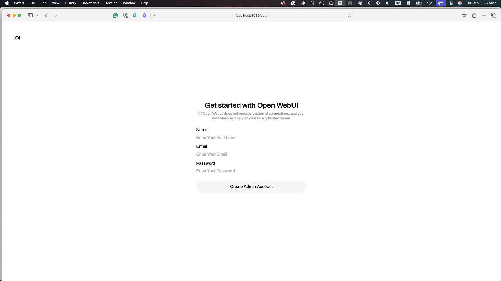
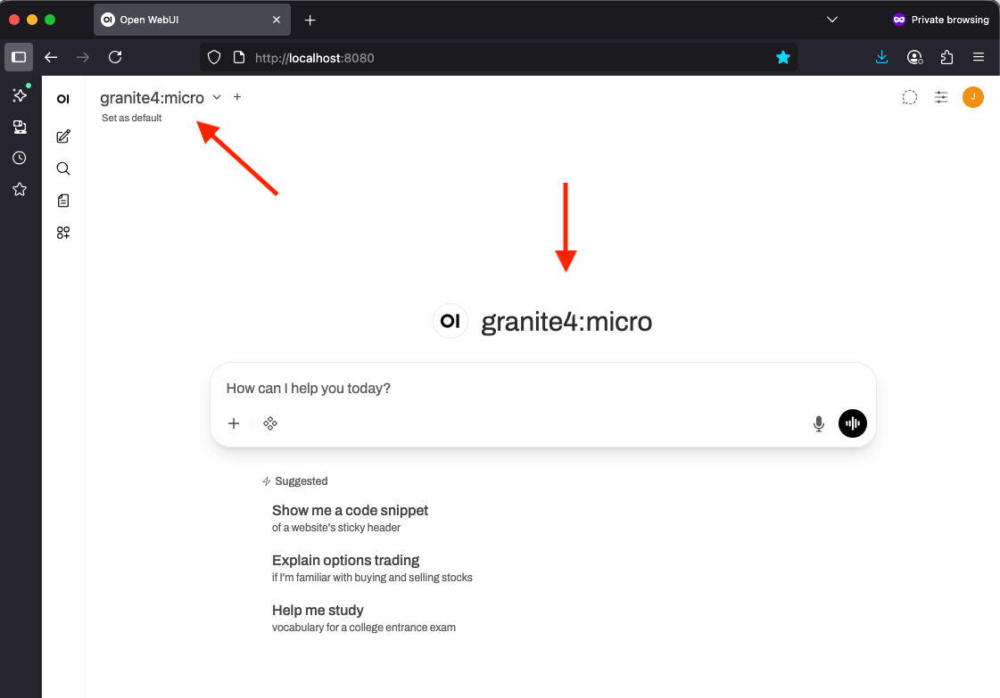
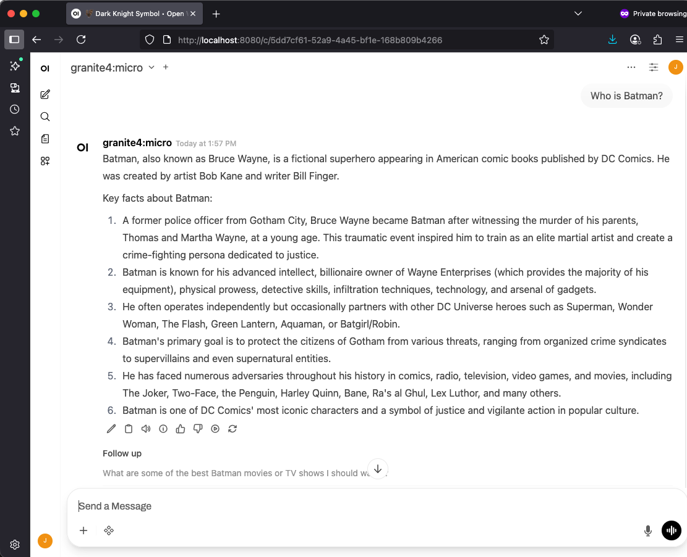

!!! warning
    This is **optional**. You don't need Open-WebUI if you have AnythingLLM already running.

Now that you have [Open-WebUI installed](../pre-work/README.md#installing-open-webui) let's configure it with `ollama` and Open-WebUI to talk to one another. The following screenshots will be from a Mac, but the gist of this should be the same on Windows and Linux.

Open up Open-WebUI (assuming you've run `open-webui serve` and nothing else), and you should see something like the following:


If you see something similar, Open-WebUI is installed correctly! Continue on, if not, please find a workshop TA or raise your hand for some help.

Before clicking the *Getting Started* button, make sure that `ollama` has `granite3.1-dense` downloaded:

```bash
ollama pull granite3.1-dense:8b
```

!!! note
    The download may take a few minutes depending on your internet connection. In the meantime, you can check out information about model we're using [here](https://ollama.com/library/granite3.1-dense). Check out how many languages it supports and take note of its capabilities. It'll help you decide what tasks you might want to use it for.

Click *Getting Started*. Fill out the next screen and click the *Create Admin Account*. This will be your login for your local machine. Remember that this because it will be your Open-WebUI configuration login information if want to dig deeper into it after this workshop.



You should see the Open-WebUI main page now, with `granite3.1-dense:latest` right there in
the center!



Test it out! I like asking the question, "Who is Batman?" as a sanity check. Every LLM should know who Batman is.

The first response may take a minute to process. This is because `ollama` is spinning up to serve the model. Subsequent responses should be much faster.



You may notice that your answer is slighty different then the screen shot above. This is expected and nothing to worry about!

**Congratulations!** Now you have Open-WebUI running and it's configured to work with `granite3.1-dense` and `ollama`. Have a quick chat with your model before moving on to the next lab!
