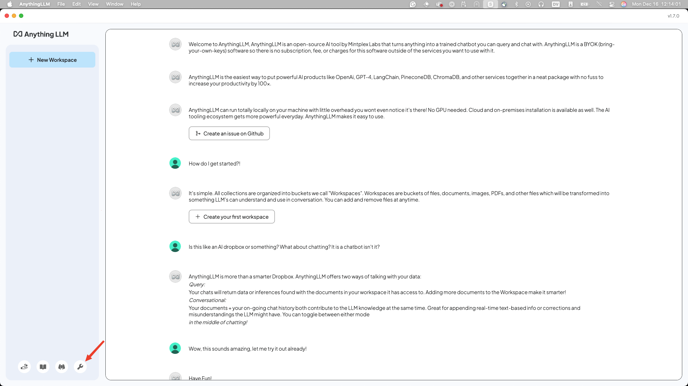

Now that you've got [AnythingLLM installed](../pre-work/README.md#anythingllm), we need to configure it with `ollama`. The following screenshots are taken from a Mac, but the gist of this should be the same on Windows and Linux.

First, if you haven't already, download the Granite 3.1 model. Open up a terminal and run the following command:

```bash
ollama pull granite3.1-dense:8b
```

!!! note
    The download may take a few minutes depending on your internet connection. In the meantime, you can check out information about model we're using [here](https://ollama.com/library/granite3.1-dense). Check out how many languages it supports and take note of its capabilities. It'll help you decide what tasks you might want to use it for.

Either click on the *Get Started* button or open up settings (the 🔧 button). For now, we are going to configure the global settings for `ollama` but you can always change it in the future.



Click on the *LLM* section, and select **Ollama** as the LLM Provider. Select the `granite3-dense:8b` model you downloaded. You'd be able to see all the models you have access to through `ollama` here.


Click the *Back to workspaces* button (where the 🔧 was) and head back to the homepage.

Click *New Workspace*.


Give it a name (e.g. the event you're attending today):


Now, let's test our connection AnythingLLM! I like asking the question, "Who is Batman?" as a sanity check. Every LLM should know who Batman is.

The first response may take a minute to process. This is because `ollama` is spinning up to serve the model. Subsequent responses should be much faster.


You may notice that your answer is slighty different then the screen shot above. This is expected and nothing to worry about!

**Congratulations!** Now you have AnythingLLM running and it's configured to work with `granite3.1-dense` and `ollama`. Have a quick chat with your model before moving on to the next lab!
