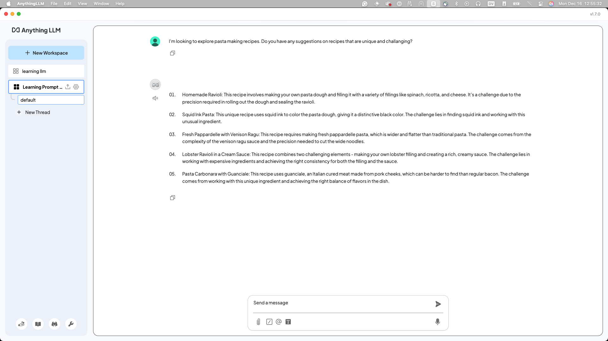
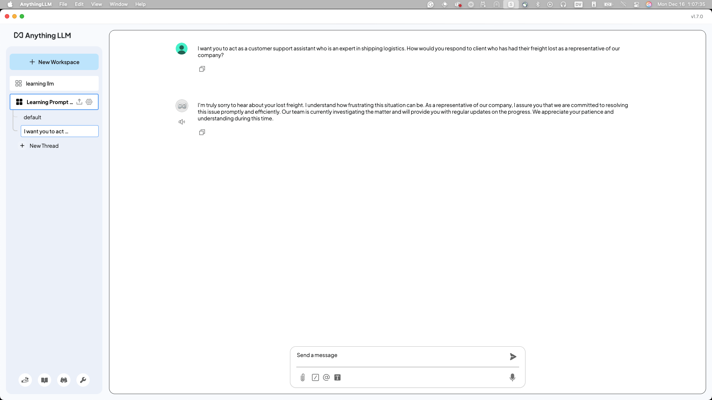

Now, here comes the fun exploration for your Prompt Engineering (PE) journey.

Open a brand _new_ Workspace in AnythingLLM (or Open-WebUI) called "Learning Prompt Engineering".


## Zero, Single, Multi Shot prompting

Let's talk about different types of prompts with examples.

### Zero-shot Prompting

These prompts don't have any previous data, structure, or guidelines provided with the request. Here's an example you can try out:

```
I want to explore pasta making recipes. 
Do you have any suggestions for recipes that are unique and challenging?
```

As you can see, this Granite model comes back with some very challenging options:



Try it for yourself, did you get a different response? Would you be satisfied with it?

I'm a fan of the "Homemade Ravioli" option in my response, so I'll ask for the recipe to make that. In the message box, in the same _thread_:

```
I do like some homemade ravioli. 
What is the spinach, ricotta and cheese recipe you suggest?
```


These simple back-and-forth questions are examples of zero-shot prompts. Try testing out the model with simple prompts like this about any subject you can think of. Next, we'll start to add some complexity to our prompts

## One-Shot and Multi-Shot Prompting

First, create a new "thread" so the context window resets. You can think of a *context window* as the amount of information a model can "remember".


In the following examples, we'll add more guidance in our prompt. By providing **one** example or structure, we achieve *one-shot prompting*. Take the provided prompts, and replace the [words] in brackets with your own choices. Have fun with it!

```
I want you to act as a customer support assistant who is [characteristic]. 
How would you respond to [text] as a representative of our [type] company?
```

My version will be:
```
I want you to act as a customer support assistant who is an expert in shipping logistics. 
How would you respond to client who has had their freight lost as a representative of our company?
```



That's not a satisfactory or interesting response, right? We need to interate on it, and provide more context about the client, like what they may have lost. **Tip: always think about adding more context!**

```
The freight they lost was an industrial refrigerator, from Burbank, California to Kanas City, MO. 
I need you to write out an apology letter, with reference to the shipping order #00234273 
and the help line of 1-800-347-2845, with a discount code of OPPSWEDIDITAGAIN for 15% off 
shipping their next order. Mention that sometimes, the trucks have accidents and need 
to be repaired and we should be able to reach out in a couple weeks.
```


So much better! By providing more context and more insight into what you are expecting in a response, we can improve the quality of our responses greatly with small tweaks.

By providing **multiple** examples, you're achieving *multi-shot prompting*!.

## Work History Prompt

You might have your resume on the laptop you're working on. If you do, you can take it and build a summary about your skill set and who you are. If you are really adventurous, you can even try to make the model write you a cover letter! *Don't forget to start a new thread!*

Here's a prompt to help you getting started, you can fill in the [words] again.

```
The following text is my resume for my career up until
my most recent job. I am [your job now] with
[number of years of experiance] considered
an expert or highly skilled individual in
[your core skill set]. I am looking to build a
couple paragraph explanation on why someone should
hire me for the next role with both my modern
skill set, and my previous expertise
```


My response has room for improvement, but gives me something to work with. Try to build off of and modify this blurb until you're happy with the quality of the response you receive. Think outside of the box!

## Summarization Prompt

Summarizing long documents or emails is a very popular use case to leverage your local AI model for.

The author of this workshop is probably older than you, but remember [CliffNotes](https://en.wikipedia.org/wiki/CliffsNotes)? Well, you have your own built-in CliffNotes bot with AI on your laptop now!

Here's a prompt to help you set up your AI model to put it "head space" this was inspired from [this website](https://narrato.io/blog/get-precise-insights-with-30-chatgpt-prompts-for-summary-generation/):

```
Generate an [X]-word summary of the following document,
highlighting key insights, notable quotes, and the overall
tone of the core point of it.
Be sure to add any specific call to actions or things that
need to be done by a specific date.
```

## Role-Playing Prompt

If you're familiar with the role-playing game Dungeons & Dragons, this excercise is for you!

```
Generate a self-contained dungeon adventure for a party of 4 adventurers,
set in a [specific environment like a forgotten temple or an abandoned mine],
with a clear objective, unique challenges, and a memorable boss encounter,
all designed to be completed in a single session of gameplay
```

The student took inspiration from [this website](https://www.the-enchanted-scribe.com/post/6-steps-one-prompt-using-chatgpt-to-generate-one-shot-d-d-adventures), which goes more in-depth, and can build out a whole game for you if you want.

The best part of this prompt is that you can take the output and extend or shorten
the portions it starts with, and tailor the story to your adventurers' needs!

## Other Ideas?

We'd love to add more to this workshop for future students, if you've come up with something
clever or maybe someone beside you has and you'd like to save it for others we'd love
a [Pull Request](https://github.com/IBM/opensource-ai-workshop/tree/main/docs/lab-2) of it.
