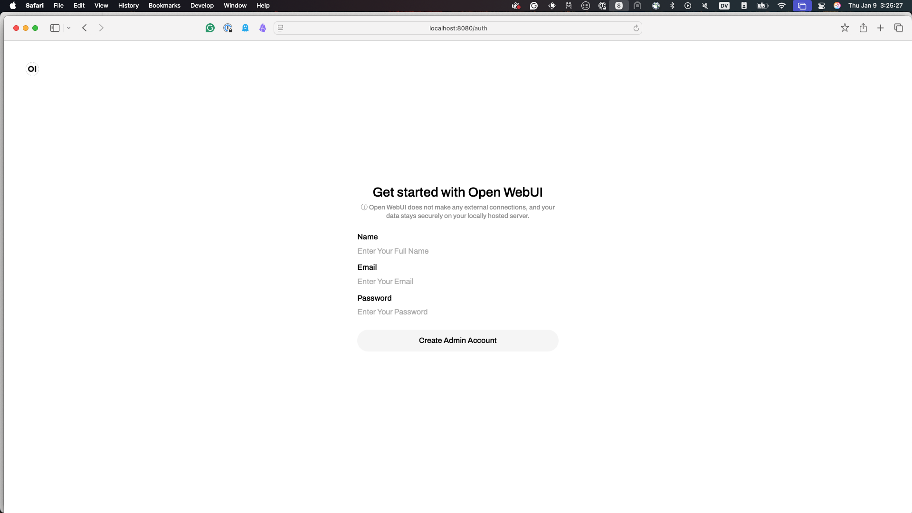

Now that you've gotten [Open-WebUI installed](../pre-work/README.md#open-webui) we need to configure it with `ollama` and Open-WebUI
to talk to one another. The following screenshots will be from a Mac, but the gist of this should be the same on Windows and Linux.

Open up Open-WebUI (assuming all you have done is `open-webui serve` and
nothing else), and you should see something like the following:


If you see this that means Open-WebUI is installed correctly, and we can continue configuration, if not, please find a workshop TA or
raise your hand we'll be there to help you ASAP.

Before clicking the "Getting Started" button, make sure that `ollama` has
`granite3.1-dense` pulled down.

```bash
ollama pull granite3.1-dense:8b
```

Run the following command to confirm you have the [granite3.1-dense](https://ollama.com/library/granite3.1-dense)
model downloaded in `ollama`. This may take a bit, but we should have a way to copy it directly on your laptop.

If you didn't know, the supported languages with `granite3.1-dense` now include:

- English, German, Spanish, French, Japanese, Portuguese, Arabic, Czech, Italian, Korean, Dutch, Chinese (Simplified)

And the Capabilities also include:

- Summarization
- Text classification
- Text extraction
- Question-answering
- Retrieval Augmented Generation (RAG)
- Code related tasks
- Function-calling tasks
- Multilingual dialog use cases
- Long-context tasks including long document/meeting summarization, long document QA, etc.

!!! note
    We need to figure out a way to copy the models into ollama without downloading.

Click the "Getting Started" button, and fill out the next screen, and click the
"Create Admin Account". This will be your login for your local machine, remember this because
it will also be the Open-WebUI configuration user if want to dig deeper into it after this workshop.



You should see the Open-WebUI main page now, with `granite3.1-dense:latest` right there in
the center!


Ask it a question, see that it works as you expect...may I suggest:

```
Who is Batman?
```


Now you may notice that the answer is slighty different then the screen shot above. That's expected and nothing to worry about. If
you have more questions about it raise your hand and one of the helpers would love to talk you about it.

Congratulations! You have Open-WebUI running now, configured to work with `granite3.1-dense` and `ollama`!

!!! note
    This was done on your local machine, take a moment and realize if you
    needed to create a shared AI enviroment, this could be easily leveraged
    here. This is very out of scope of this workshop, but the TAs can help if
    you have some general questions around running this in this "space."

