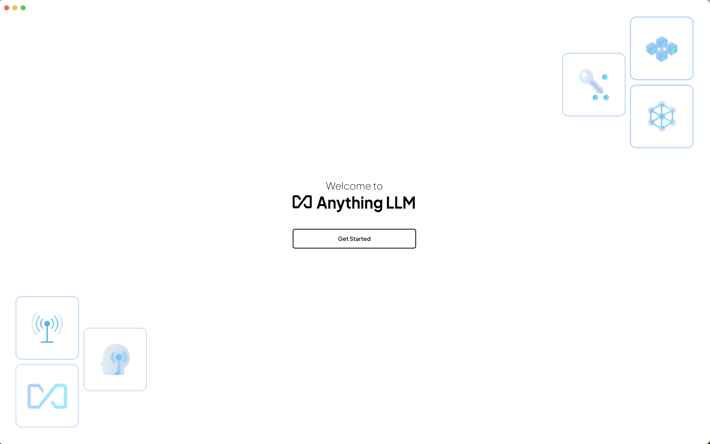
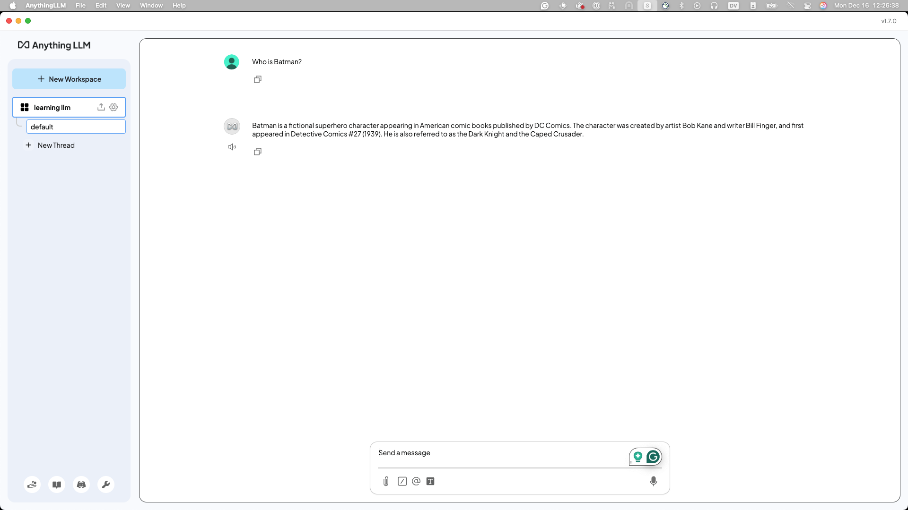

# Configuring AnythingLLM

Now that you've gotten [AnythingLLM installed](../pre-work/README.md#anythingllm) we need to configure it with `ollama` and AnythingLLM
to talk to one another. The following screenshots will be from a Mac, but the gist of this should be the same on Windows and Linux.

Open up AnyThingLLM, and you should see something like the following:


If you see this that means AnythingLLM is installed correctly, and we can continue configuration, if not, please find a workshop TA or
raise your hand we'll be there to help you ASAP.

Next as a sanity check, run the following command to confirm you have the [granite3.1-dense](https://ollama.com/library/granite3.1-dense)
model downloaded in `ollama`. This may take a bit, but we should have a way to copy it directly on your laptop.

If you didn't know, the supported languages with `granite3.1-dense` now include:
- English, German, Spanish, French, Japanese, Portuguese, Arabic, Czech, Italian, Korean, Dutch, Chinese (Simplified)

And the Capabilities also include:
- Summarization
- Text classification
- Text extraction
- Question-answering
- Retrieval Augmented Generation (RAG)
- Code related tasks
- Function-calling tasks
- Multilingual dialog use cases
- Long-context tasks including long document/meeting summarization, long document QA, etc.

!!! note
    We need to figure out a way to copy the models into ollama without downloading.

```bash
ollama pull granite3.1-dense:8b
```

Next click on the `wrench` icon, and open up the settings. For now we are going to configure the global settings for `ollama`
but you may want to change it in the future.


Click on the "LLM" section, and select **Ollama** as the LLM Provider. Also select the `granite3-dense:8b` model. (you should be able to
see all the models you have access to through `ollama` there.)


Click the "Back to workspaces" button where the wrench was. And Click "New Workspace."


Name it something like "learning llm" or the name of the event we are right now, something so you know it's somewhere you are learning
how to use this LLM.


Now we can test our connections _through_ AnythingLLM! I like the "Who is Batman?" question, as a sanity check on connections and that
it knows _something_.



Now you may notice that the answer is slighty different then the screen shot above. That's expected and nothing to worry about. If
you have more questions about it raise your hand and one of the helpers would love to talk you about it.

Congratulations! You have AnythingLLM running now, configured to work with `granite3.1-dense` and `Ollama`!

