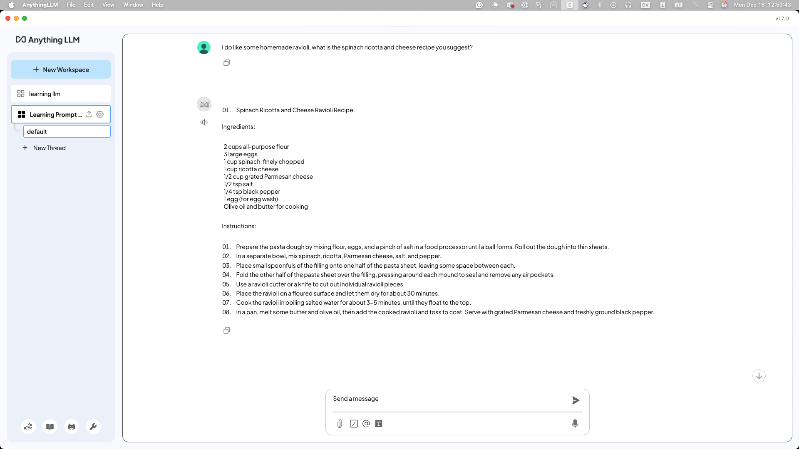

!!! note
    This lab was informed by [@juliandiscovers](https://www.youtube.com/channel/UCXKuHxwAeZZu_dg_qs8Z-9w) and [@BenzaMaman](https://www.instagram.com/benzamaman/)'s workshops and content and presents a broad overview of what they teach. If you want to dive deeper into Prompt Engineering we recommend checking them out.

## What is Prompt Engineering (PE)?

Prompt engineering is the practice of designing clear, intentional instructions to guide the behavior of an AI model.

It involves crafting prompts that help a model identify what task to perform, how to perform it, and if there are considerations in style or format. This can include specifying tone, structure, context, or even assigning the AI a particular role.

Prompt engineering is essential because the quality and precision of the prompt can significantly influence the quality, relevance, and creativity of the generated output. As generative models become more powerful, skillful prompting becomes a key tool for unlocking their full potential.

### The Three Key Principles of PE

1. Specificity - The more detailed your criteria, the more focused and relevant the output will be.
2. Step-by-step structuring - Break complex tasks down into smaller parts to guide the model more effectively.
3. Iterative refinement - Adjust your prompt or build on previous responses to achieve the best result.

### What Makes a Good Prompt?

1. Use natural, unambiguous language – Phrase your prompt as if you're explaining the task to a person.
2. Provide guiding context – Share relevant background information, examples, or constraints to clarify your intent.
3. Define format and tone when needed – Specify style, structure, or voice (e.g., bullet points, formal, pirate).
4. Adapt based on responses – Treat the model’s output as feedback and refine accordingly.

### The Prompting Workflow

1. Define the problem or goal → *“I want a fun fact about cats to share with kids.”*
2. Include relevant context and keywords → *“Keep it short, easy to understand, and fun.”*
3. Write the prompt → *“Tell me a fun and simple fact about cats that a 7-year-old would enjoy.”*
4. Test, evaluate, and iterate → If the fact is too complex: *“Make it even simpler and add a playful tone.”*

## Types of Prompts

Open a brand _new_ Workspace in AnythingLLM (or Open-WebUI) called "Learning Prompt Engineering". Read along with the examples below, and be sure to try them out for yourself!

### Zero-shot Prompting

These prompts don't have any previous data, structure, or guidelines provided with the request. Here's an example:

```
I want to explore pasta making recipes. 
Do you have any suggestions for recipes that are unique and challenging?
```

As you can see, this Granite model comes back with some very challenging options:


Try it for yourself, did you get a different response? Think about how the response could be better.

As a follow-up, I'll ask for the recipe to make the "Homemade Ravioli" option in the response I received:

```
I do like some homemade ravioli. 
What is the spinach, ricotta and cheese recipe you suggest?
```



These simple back-and-forth questions are examples of **zero-shot prompts*.

Come up with your own zero-shot prompt about any subject you want. Then, we'll start to add some complexity to our prompts.

## One-Shot and Multi-Shot Prompting

First, create a new "thread" so the context window resets. You can think of a *context window* as the amount of information a model can "remember".


In the following examples, we'll add more guidance in our prompt. By providing **one** example or structure, we achieve *one-shot prompting*.

Take the provided prompts, and replace the [words] in brackets with your own choices. Get creative with it!

```
I want you to act as a customer support assistant who is [characteristic]. 
How would you respond to [text] as a representative of our [type] company?
```

My version will be:
```
I want you to act as a customer support assistant who is an expert in shipping logistics. 
How would you respond to client who has had their freight lost as a representative of our company?
```


That's not a satisfactory or interesting response, right? We need to interate on it, and provide more context about the client, like what they may have lost. **Tip: always think about adding more context!**

```
The freight they lost was an industrial refrigerator, from Burbank, California to Kanas City, MO. 
I need you to write out an apology letter, with reference to the shipping order #00234273 
and the help line of 1-800-347-2845, with a discount code of OPPSWEDIDITAGAIN for 15% off 
shipping their next order. Mention that sometimes, the trucks have accidents and need 
to be repaired and we should be able to reach out in a couple weeks.
```


So much better! By providing more context and more insight into what you are expecting in a response, we can improve the quality of our responses greatly. Also, by providing **multiple** examples, you're achieving *multi-shot prompting*!.

## Conclusion

Now that you know the basics of prompt engineering and simple techniques you can use to level-up your prompts, let's move on to [Lab 4](https://ibm.github.io/opensource-ai-workshop/lab-4/) and apply what you've learned with some exercises.
