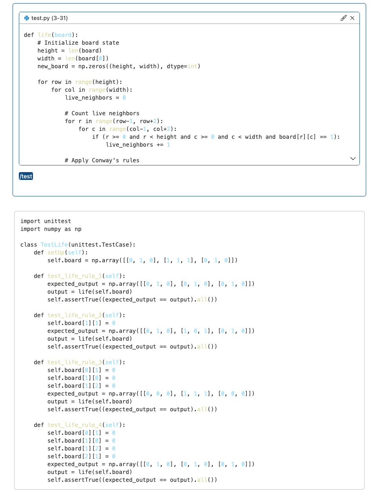
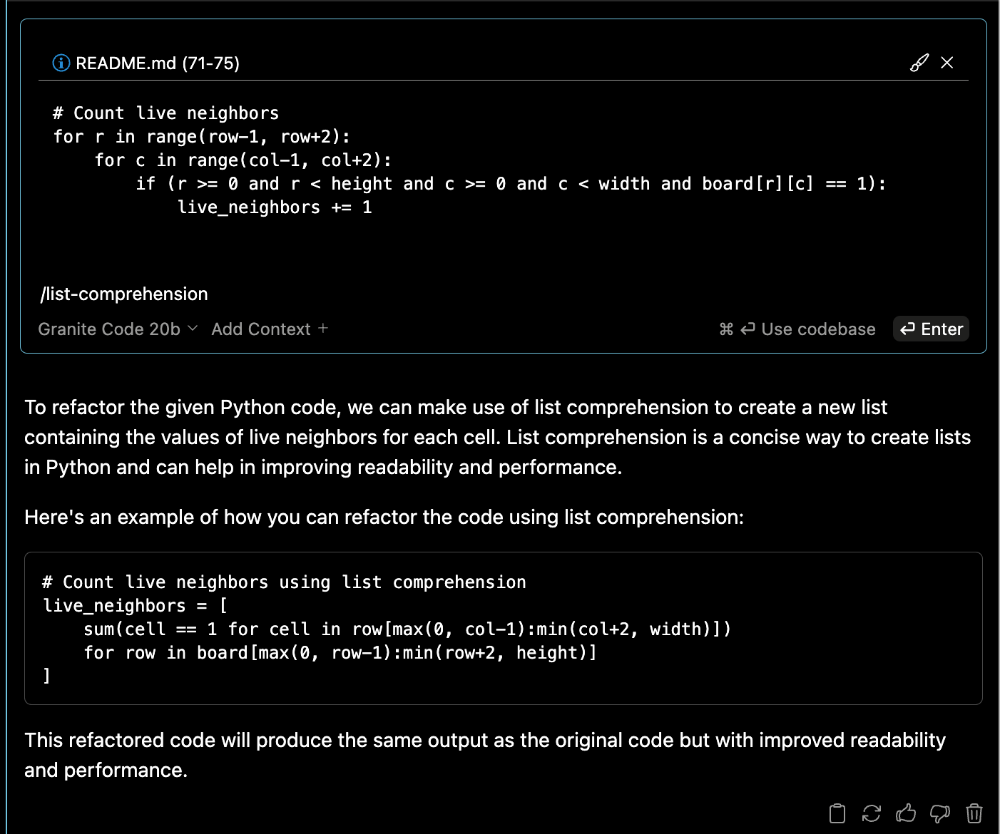

# Customizing Your Local AI Code Assistant

Now we're going to play with some of the advanced features of Continue, so we can make the most of our new local code assistant.

## Setup

Make sure you've completed the [prework](../pre-work) and [Lab 1](../lab-1) before you get started.

## Defining Custom Commands

As you start using your local code assistant on a regular basis to help you code, you may want to simplify some of your interactions. It gets tedious having to describe your need for tests to your editor repeatedly - and don't most developers love a good shortcut?

Becoming a pro at using LLMs also requires putting a lot of detail in your prompts (the text you enter when you talk to the LLM) in order to get the behavior you want from your AI. That means you're likely to see your best results if you're able to retain your best and most successful prompts for future use.

Let's look at two different commands - one to generate tests for your code, one to have your code use more list comprehensions, and one to simplify your code for readability.

### Using the default custom command for tests

Open up your `config.json` file again - Cmd/Ctrl+Shift+P, then type "continue config". Select the item that says "Continue: Open config.json" and press enter.

Find the section for `"customCommands"`, which will look something like this:

```json
  "customCommands": [
    {
      "name": "test",
      "prompt": "{{{ input }}}\n\nWrite a comprehensive set of unit tests for the selected code. It should setup, run tests that check for correctness including important edge cases, and teardown. Ensure that the tests are complete and sophisticated. Give the tests just as chat output, don't edit any file.",
      "description": "Write unit tests for highlighted code"
    }
  ],
```

We're in luck! There's one all set up for us to write tests. Let's try it.

If you've already done [Lab 2](../lab-2), you'll already have a Python file with an implementation of Conway's Game of Life in it. If not, head there and generate yourself some code.

Now, select one of the functions in your code. Press `Cmd / Ctrl + L` to add your selected code into the context. You should now see a copy of your code show up in your Continue panel.

Below that, you can invoke the `test` command by typing: `/test`

Press enter and try it out! You'll see something like this - though as always, your code will look different than the code here. In a real case, you'd want to edit it to make sure it behaves the way you want it to.



### Adding a new custom command for list comprehensions

Let's add a second custom command that allows us to refactor Python code that we've selected to use more list comprehensions.

Open the `config.json` for Continue again. (Remember, Cmd/Ctrl+Shift+P, then type "continue config". Select the item that says "Continue: Open config.json" and press enter.)

Add a new JSON blob describing the `list-comprehension` custom command, which asks the model to refactor selected python code to use list comprehensions.

```json
"customCommands": [
  ...,
  {
    "name": "list-comprehension",
    "prompt": "{{{ input }}}\n\nRefactor the selected python code to use list comprehensions wherever possible. Present the output as a python code snippet.",
    "description": "Refactor to use list comprehensions"
  }
 ]
```

If you completed Lab 2, you might have a copy of some AI-generated Python code that implements Conway's Game of Life. If not, here's a sample snippet that could be expressed in a list comprehension. (A very long and messy list comprehension, but a list comprehension nonetheless!)

You can either select a loop-heavy section of your Lab 2 code, or select this and put it in a new *.py file in VSCode.

Then press Cmd+L to send the selection to Continue.

```python
# Count live neighbors
for r in range(row-1, row+2):
    for c in range(col-1, col+2):
        if (r >= 0 and r < height and c >= 0 and c < width and board[r][c] == 1):
            live_neighbors += 1
```

From there, let's invoke our list comprehension command, typing `/list-comprehension`:



That leaves us with:

```python
# Count live neighbors using list comprehension
live_neighbors = [
    sum(cell == 1 for cell in row[max(0, col-1):min(col+2, width)])
    for row in board[max(0, row-1):min(row+2, height)]
]
```

Now we have a version of our Game of Life code!

### Bonus: Adding a command to simplify your code

Now that you've got the hang of this, try adding this custom command for code simplification and readability to your config. After all, the goal of coding isn't usually to win at code golf.

Going back to your `config.json`, let's add something more complex:

```json
  {
    "name": "code-readability",
    "prompt": "{{{ input }}}\n\nRefactor the selected python code to improve the simplicity and readability of the code. Consider renaming variables to make them more understandable to humans. Add comments where necessary to explain what the code is doing when it gets too complex. Break down functions that accept too many parameters. Break up computations so that there's typically only one computation per line.",
    "description": "Refactor code for simplicity and readability."
  }
```

Note that the prompt we're giving here is a lot more complex and specific about what we want the LLM's response to look like. One of the key lessons of coding effectively with AI generation is that there's only so far an LLM can get with a vague prompt. We want to learn to be very specific about what ends we want accomplished, much as you might want to do with a junior colleague.

Now that we've got that set up, let's take a second look at the code that came out of the `/list-comprehensions` command. Let's see if our LLM can help us adjust it to be more readable.

Here's one example of our new code!


```python
def count_live_neighbors(board, row, col):
    """
    Counts the number of live neighbors for a given cell in a game board.

    Parameters:
        board (list[list[int]]): The game board to check.
        row (int): The row index of the cell.
        col (int): The column index of the cell.

    Returns:
        int: The number of live neighbors.
    """
    height = len(board)
    width = len(board[0])
    num_neighbors = 0

    for r in range(max(0, row-1), min(row+2, height)):
        for c in range(max(0, col-1), min(col+2, width)):
            if r == row and c == col:
                continue
            num_neighbors += board[r][c]

    return num_neighbors
```