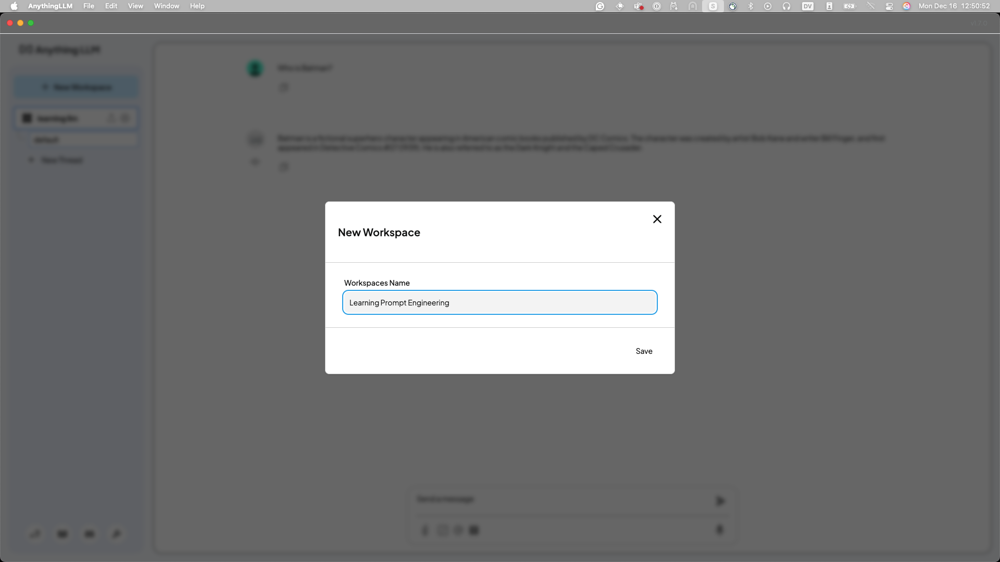
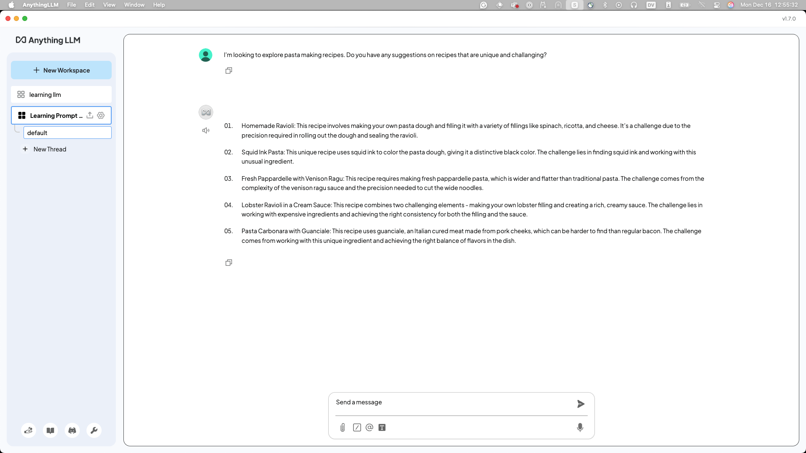
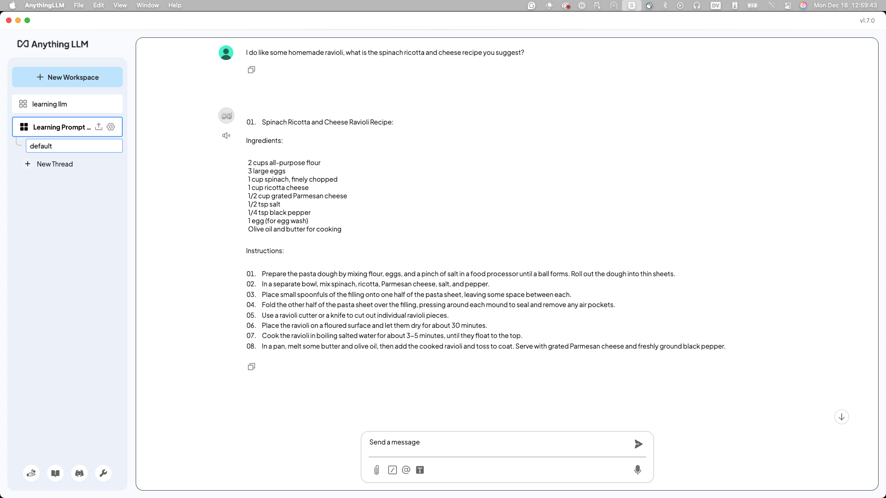
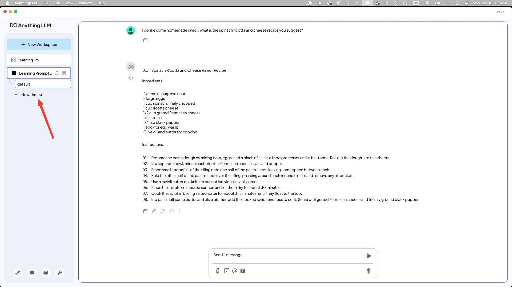
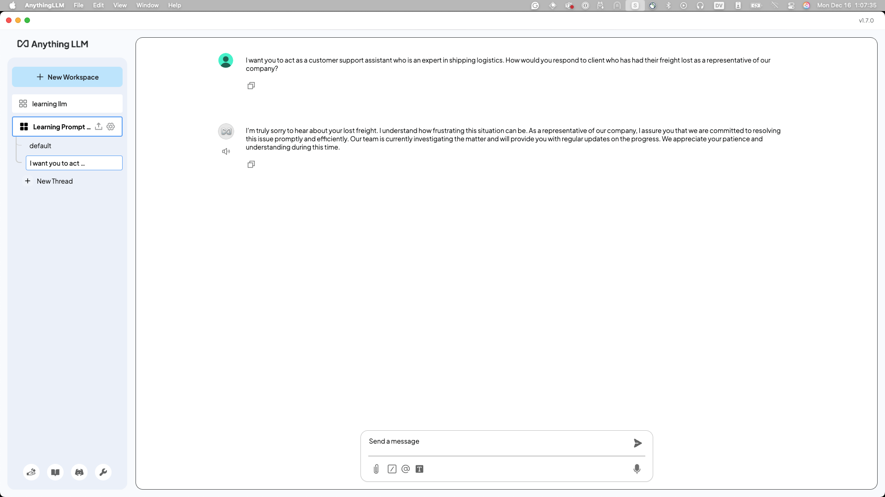
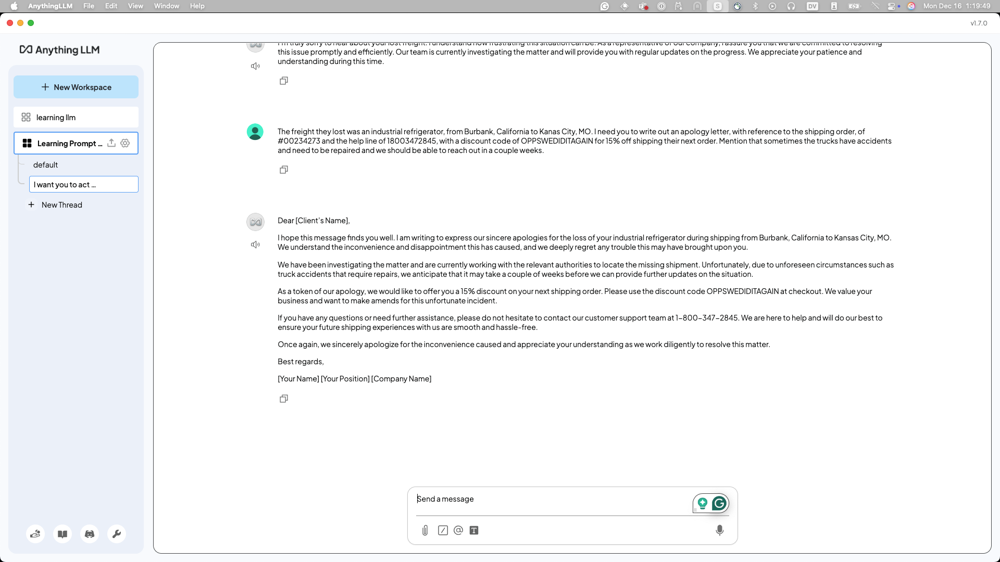
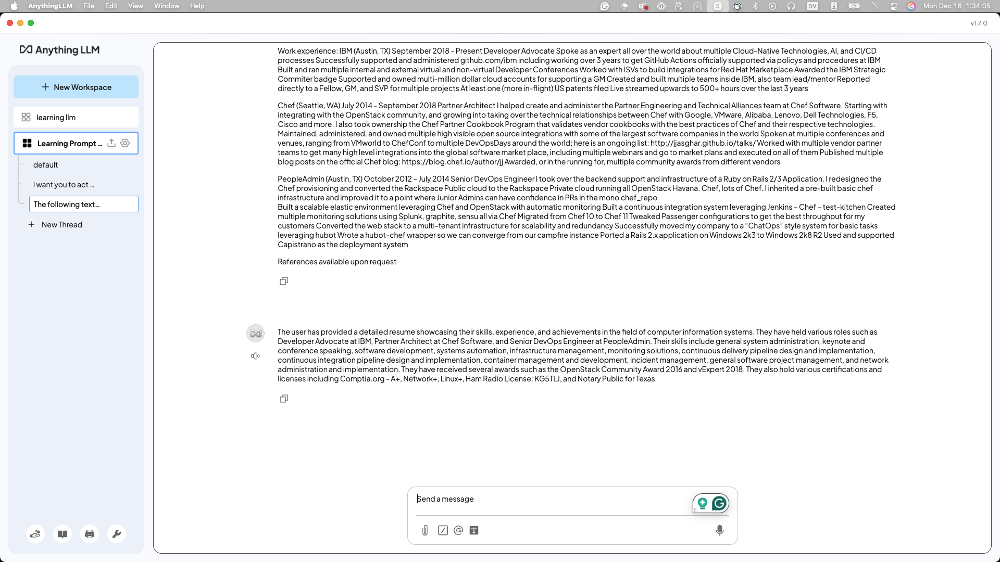

Now here comes the fun part, and exploration for your Prompt Engineering (PE) journey.
Be sure you have AnythingLLM (or Open-WebUI) available, and open in a _new_ Workspace.
The testing "Who is Batman?" workspace should be left alone for this.
Maybe call it "Learning Prompt Engineering" or the like, just like below.



## Zero, Single, Multi Shot prompting

Now that we've played with a couple different versions of prompts, lets talk about the differences between them:

- Zero Shot: No previous data or guidelines given before completing request.
  - Our "brain storming prompt" was a zero shot prompt, it just started with "do this thing." Then we built off of it, and turned it into a Single Shot prompt.
- One Shot: One piece of data or guideline given before completing request.
  - Our email option was a One Shot/Single Shot prompt, because we gave more context on the email and referenced the situation. You'll notice that this is where you'll normally start.
- Few Shot: Multiple pieces of data or guidelines given before completing request.
  - Finally our resume one is a Few Shot, because hopefully you did some back and forth to build out a great blurb about yourself, and how you can be ready for this next great job.

## Brain storming prompt

Now lets try our first real prompt, copy the following into the message box:
```
I'm looking to explore [subject] in a [format].
Do you have any suggestions on [topics] I can cover?
```

This is a good "brain storming idea" prompt. Fill in `[subject]`, `[format]`, and `[topics]` for liking,
I'll be running:
```
I'm looking to explore pasta making recipes. Do you
have any suggestions on recipes that are unique and challanging?
```

As you can see granite-3.1 comes back with some very challenging options:



Now if you put the same question in does it give you the same? Or is it different?

I'm a fan of Homemade Ravioli, so lets ask what the recipe is for that, in the message box in this _thread_ I'll write
out:
```
I do like some homemade ravioli, what is the spinach
ricotta and cheese recipe you suggest?
```



Now this may seem odd, or even pointless, but hopefully you can start seeing that if you treat the prompt like
a conversation that you interate on, you can talk back and forth with the granite-3.1 and find interesting
nuggets of knowledge.

## Client or Customer email generation

Next create a new "thread" so the context window resets, and lets try something everyone has probably already
done, but give you a "mad libs" prompt that can help just churn them out for you.



Take the following prompt, and fill it out to your content. Have some fun with it :)
```
I want you to act as a customer support assistant who
is [characteristic]. How would you respond to [text]
as a representative of our [type] company?
```

My version will be:
```
I want you to act as a customer support assistant who
is an expert in shipping logistics.  How would you respond
to client who has had their freight lost as a
representative of our company?
```



Oh, that's not nearly enough, or interesting right? Well it's because we haven't interated on it, we just wrote a "client" with no context, or what they may
have lost. So lets see if we can fill it out more:
```
The freight they lost was an industrial refrigerator,
from Burbank, California to Kanas City, MO. I need you to
write out an apology letter, with reference to the
shipping order, of #00234273 and the help line of 18003472845,
with a discount code of OPPSWEDIDITAGAIN for 15% off
shipping their next order.
Mention that sometimes the trucks have accidents and
need to be repaired and we should be able to reach
out in a couple weeks.
```



So much better! With more context, and more of a back story to what you are asking for, building off the intial prompt, we got something
that with just a small tweaks we can email to our client.

## Your work history prompt

You probably have your resume on this machine we are working on right? Lets take it and build a "blurb" about your skill set and who you are
and maybe if you are feeling adventurous you can even get a cover letter out of it. (Don't forget to start a new thread!)

Here's a prompt to help you getting started:
```
The following text is my resume for my career up until
my most recent job. I am [your job now] with
[number of years of experiance] considered
an expert or highly skilled individual in
[your core skill set]. I am looking to build a
couple paragraph explanation on why someone should
hire me for the next role with both my modern
skill set, and my previous expertise
```



Now for mine, it wasn't great, but it at least give me somethings to work off of. Again, this is just a start, but you can build off of this blurb and
see what you can actually accomplish.

## Summarization Prompt

Something you'll discover quickly is that leveraging your local AI model to summarize long documents and/or emails can help figure out if you
actually need to read the details of something. Showing the age of the author here, but remember [CliffNotes](https://en.wikipedia.org/wiki/CliffsNotes)? Yep, you have your own
built in CliffNotes bot with AI.

Here's a prompt to help you set up your AI model to put it "head space" this was inspired from [this website](https://narrato.io/blog/get-precise-insights-with-30-chatgpt-prompts-for-summary-generation/):

```
Generate an X-word summary of the following document,
highlighting key insights, notable quotes, and the overall
tone of the core point of it.
Be sure to add any specific call to actions or things that
need to be done by a specific date.
```

## Role playing prompt

If you noticed in the previous lab we talked about leveraging a single prompt to build a
"single shot" role playing if you skipped it, we'll be going over it again here.

```
Generate a self-contained dungeon adventure for a party of 4 adventurers,
set in a [specific environment like a forgotten temple or an abandoned mine],
with a clear objective, unique challenges, and a memorable boss encounter,
all designed to be completed in a single session of gameplay
```

The student took inspiration from [this website](https://www.the-enchanted-scribe.com/post/6-steps-one-prompt-using-chatgpt-to-generate-one-shot-d-d-adventures), which goes deeper in depth, and can build out the
whole thing for you if you want.

The best part of this prompt is that you can take the output and extend or contract
the portions it starts with, and tailor the story to your adventurers needs!

## Other ideas?

We'd love to add more to this workshop for future students, if you've come up with something
clever or maybe someone beside you has and you'd like to save it for others we'd love
a [Pull Request](https://github.com/IBM/opensource-ai-workshop/tree/main/docs/lab-5) of it.


!!! success
    Thank you SO MUCH for joining us on this workshop, if you have any thoughts or questions
    the TAs would love answer them for you. If you found any issues or bugs, don't hesitate
    to put a [Pull Request](https://github.com/IBM/opensource-ai-workshop/pulls) or an
    [Issue](https://github.com/IBM/opensource-ai-workshop/issues/new) in and we'll get to it
    ASAP.
