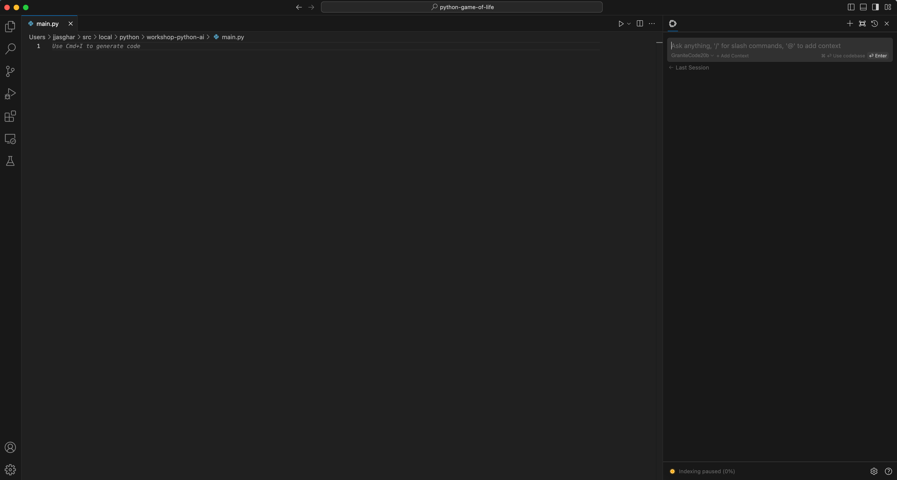
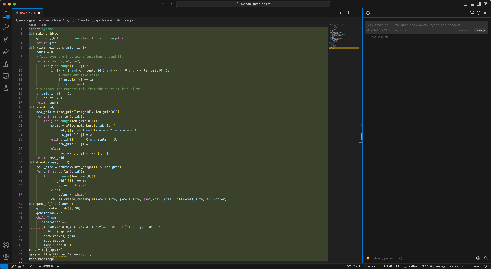
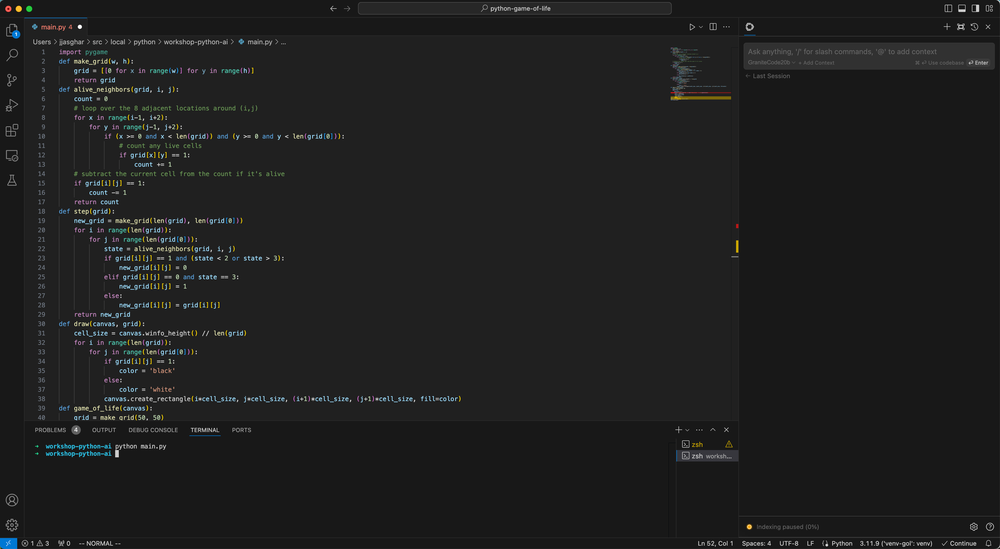
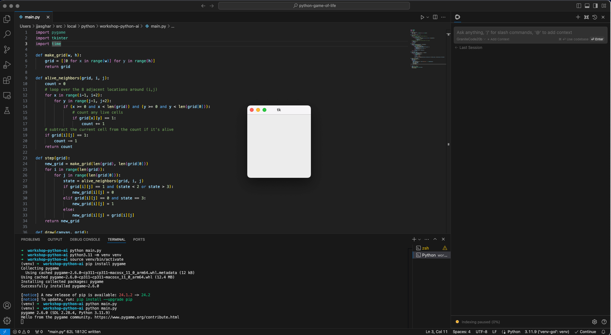
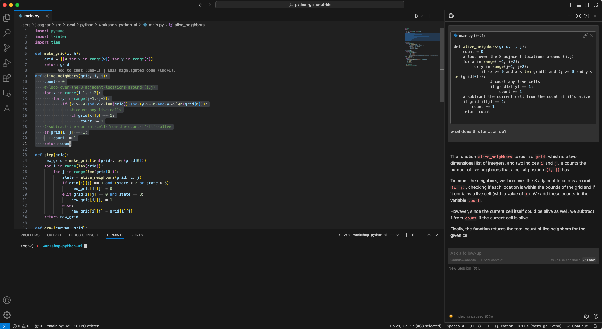
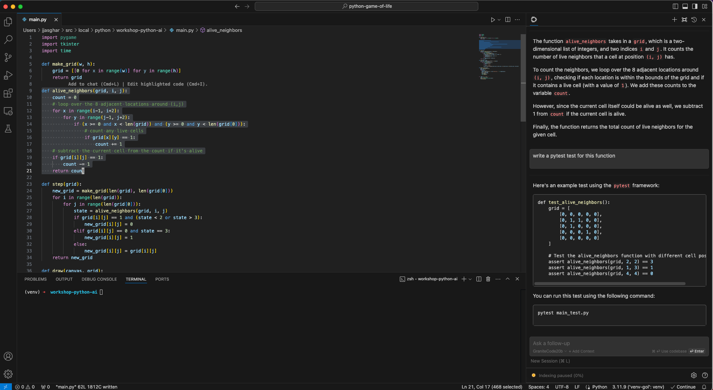
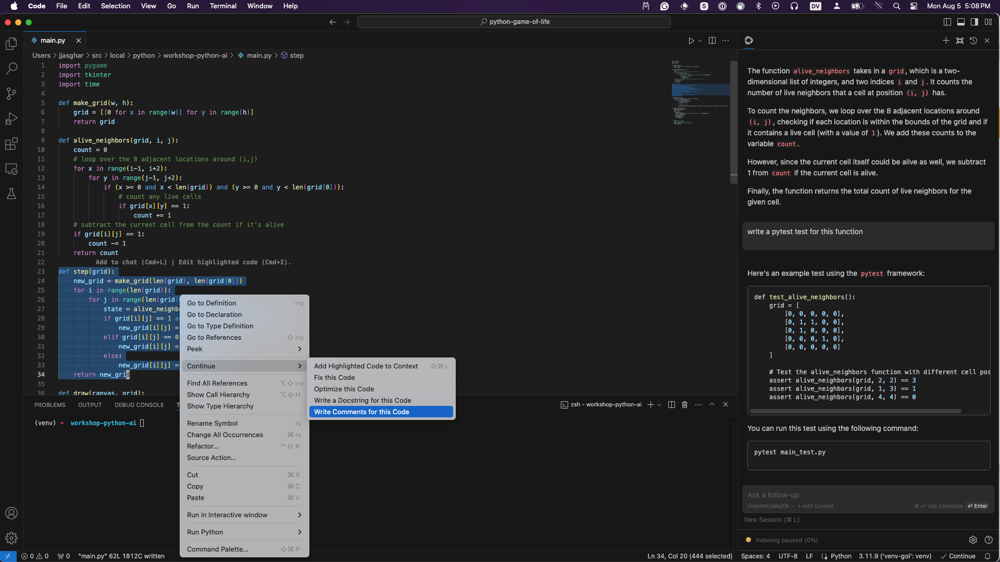

## Setup

First, get comfortable with Continue. For example, if you prefer that your local assistant have its own slice of the window, you can drag it to the right sidebar.


You can also take a look at the [Continue documentation](https://docs.continue.dev/chat/how-to-use-it), or at least have it open in case you want to refer to it.

Now that our local AI co-pilot is up and running, let’s put it to work. The following examples will focus on `python`, but the same approach applies to other languages like `go`, `javascript`, or `rust`. 

A key part of learning to use this technology effectively is exploring the boundaries of what it can and can’t do.

As you work through this lab, keep in mind: this assistant is here to support your workflow — not to do the work for you!

!!! tip
    If you lose the Continue pane in VSCode, you can re-enable it in VSCode by clicking at the top of the screen under "View --> Appearance --> Secondary Side Bar" and then the Continue window will be visible again.

## Writing a `main.py`

Clear the Continue window using `cmd+l` so we can start with a clean slate and create a new file called `main.py` in a new directory.



With your `main.py` open, use the `cmd+i` to open up the `Generate Code` command palette. You should see some information about what file and line will be edited. Give it the following prompt:

```
Write the code for conway's game of life using pygame
```

!!! note
    [What is Conway's Game of Life?](https://en.wikipedia.org/wiki/Conway's_Game_of_Life)

After a few moments, the mode should start writing code in the file, it might look something like:


## AI-Generated Code

You can try to run it... *but would it work?* Do you see any potential errors in this code? If the code you generated worked, then consider yourself lucky! You can see below that this instance of generated code doesn't provide any output.



This is an important lesson for using _any_ AI co-pilot code assistants. While they can provide a lot of helpful code towards what you need, it often won't get you across the finish line.

## Cleaning up the AI-Generated Code

At this point, you can practice debugging or refactoring code with the AI co-pilot. Maybe it's a missing indent or the functions could be better organized for your understanding.

!!! note
    You can try using the built-in autocomplete and code assistant functions to generate any missing code.
    In the example generated code, a "main" entry point to the script is missing. In this case, using `cmd+I` again and trying the prompt: "write a main function for my game that plays ten rounds of Conway's
    game of life using the `board()` function." might help. What happens?

It's hard to read the generated case in the example case, making it hard to read the logic. To clean it up, I'll define a `main` function so the entry point exists. There was also a `tkinter` section in the generated code, I decided to put the main game loop there:

```python
if __name__ == '__main__':
    root = tkinter.Tk()
    game_of_life(tkinter.Canvas(root))
    root.mainloop()
```

In this generated code, there are also missing imports:

```python
import tkinter
import time
```

It looks like the code is improving:



## Explaining the Code

To debug further, use Granite-Code to explain what the different functions do. Simply highlight one of them, and use `cmd+L` to add it to the context window of your assistant and write a prompt similar to:

```text
what does this function do?
```



Asking for an explanation of portions of code can be very helpful with understanding logic that isn't clear right away. The model might even catch or highlight problems in the code if your prompt encourages it to.

## Creating Tests

One of the most effective ways to streamline your workflow as a developer is by writing tests for your code. Tests act as a safety net, helping you catch unintended changes. Tests can be time-consuming to write, and Granite Code can help generate them for you.

Assuming you still have a function you wanted explained above in the context-window for your local assistant, you can use the prompt:

```text
write a pytest test for this function
```

Now I got a good framework for a test here:


Notice that my test only spans what is provided in the context, so the test isn't integrated into my project yet. But, the code provides a good start. I'll need to create a new test file and integrate `pytest` into my project.

## Adding Comments

Continue also provides the ability to automatically add comments to code:




## Conclusion


!!! success
    Thank you SO MUCH for joining us on this workshop, if you have any thoughts or questions
    the TAs would love answer them for you. If you found any issues or bugs, don't hesitate
    to put a [Pull Request](https://github.com/IBM/opensource-ai-workshop/pulls) or an
    [Issue](https://github.com/IBM/opensource-ai-workshop/issues/new) in and we'll get to it
    ASAP.
