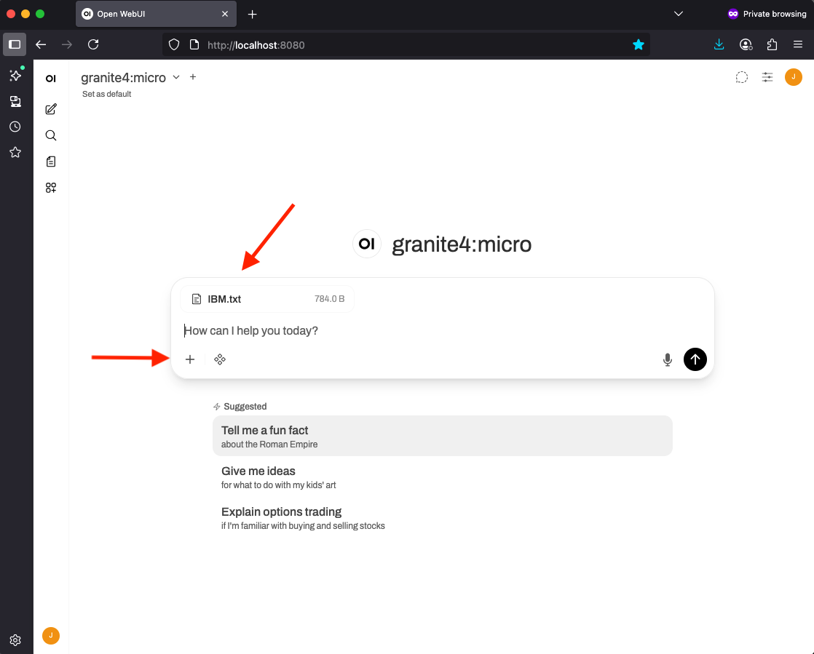
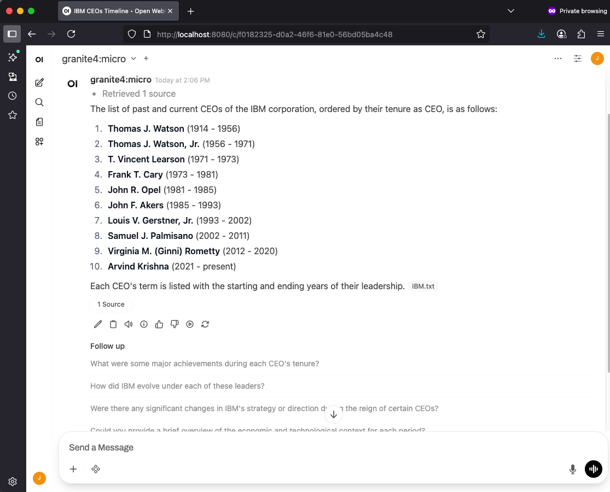

## Retrieval-Augmented Generation Overview
The LLMs we're using for these labs have been trained on billions of parameters, but they haven't been trained on everything, and the smaller models have less general knowledge to work with.
For example, even the latest models are trained with aged data, and they couldn't know about current events or the unique data your use-case might need.

RAG allows the user to supplement the LLM's data with up-to-date information from external sources, like databases and documents.

In this lab we're going to use one of the smallest IBM Granite models and show that it's answer is not complete. Then we'll add a small RAG document and allow it render a much better answer
utilizing both it's internal data combined with the RAG data you give it.

## Configuration and Sanity Check

Open up [Open-WebUI](http://localhost:8080/), and you should see something like the following:


If you see this that means Open-WebUI is installed correctly, and we can continue configuration, if not, please find a workshop TA or
raise your hand we'll be there to help you ASAP.

Next as a sanity check, run the following command to confirm you have the [granite3.3:2b](https://ollama.com/library/granite3.3:2b)
model downloaded in `ollama`. This may take a bit, but we should have a way to copy it directly on your laptop.

```bash
ollama pull granite3.3:2b
```

If you didn't know, the supported languages with `granite3.3:2b` now include:

- English, German, Spanish, French, Japanese, Portuguese, Arabic, Czech, Italian, Korean, Dutch, and Chinese. However, users may fine-tune this Granite model for languages beyond these 12 languages.

And the Capabilities also include:

- Thinking
- Summarization
- Text classification
- Text extraction
- Question-answering
- Retrieval Augmented Generation (RAG)
- Code related tasks
- Function-calling tasks
- Multilingual dialog use cases
- Fill-in-the-middle
- Long-context tasks including long document/meeting summarization, long document QA, etc.


Next click on the down arrow at the top and select the "granite3.3:2b" if it's not already selected.


Click on the "New Chat" icon to clear the context. Then, ask the model for:
```bash
List all the past and current CEOs of the IBM corporation in order of their term as CEO
```
For example:


At first glance, the list looks pretty good. But if you know your IBM CEOs, you'll notice that it misses a few of them, and sometimes adds new names that weren't ever IBM CEOs!
(Note: the larger granite3.3:8b does a much better job on the IBM CEOs, you can try it later)
But we can provide the small LLM with a RAG document that supplements the model's missing information with a correct list, so it will generate a better answer.

Click on the "New Chat" icon to clear the context.  Then download a small text file with the correct list of IBM CEOs to your Downloads folder:

[IBM.txt](../resources/IBM.txt)

Right click on the IBM.txt URL and select "Save Link As" and save it as IBM in your Downloads folder.

In your Open-WebUI browser, click on the "+" under the "send a message" prompt and then select "Upload files"

Select the IBM.txt file that you just downloaded in your Downloads folder and press Open.



Now ask it our question about the CEOs of IBM:
```bash
List all the past and current CEOs of the IBM corporation in order of their term as CEO
```
The answer should now be correct. (For example, always before it forgets John Akers)



If you look near the bottom of the answer, you can see the RAG source that it used, along with some options you can click on, including information on the tokens per second and total tokens.


We can also find and download information to pdf from Wikipedia:
For example: [History of IBM](https://en.wikipedia.org/wiki/History_of_IBM)

On the right of the Wikipedia page, click on "Tools" and click on "Download as PDF"

Then use this History_of_IBM.pdf as a RAG by clicking on the + and select "History_of_IBM.pdf" as a file from your Downloads folder.

Next, use the Open-WebUI to ask more questions about IBM, or have it summarize the document itself.  For example:
```bash
Write a short 150 word summary of the History_of_IBM.pdf
```


Congratulations, you've completed the Open-WebUI RAG example.
